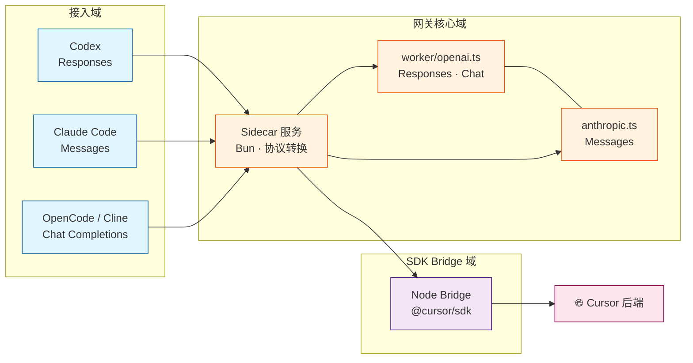

# cursor2api

<p align="center">
  <strong>面向 Cursor Composer 的 OpenAI / Anthropic 兼容 API 网关</strong><br>
  同时支持 <code>Responses</code> · <code>Messages</code> · <code>Chat Completions</code> 三种协议
</p>

<p align="center">
  <a href="https://github.com/NGLSG/cursor2api">GitHub</a>
  ·
  <a href="#快速部署">快速部署</a>
  ·
  <a href="#api">API 文档</a>
  ·
  <a href="#客户端接入">客户端接入</a>
</p>

> [!NOTE]
> 本项目仅供技术研究与学习交流。使用时请务必遵循 Cursor 官方使用条款及当地法律法规。

## 项目简介

**cursor2api** 是一个轻量级 API 网关，把你的 **Cursor API Key**（`crsr_…`）转成标准 HTTP 接口。客户端只需配置 `baseUrl` + `apiKey`，即可接入 Cursor 上的 Composer、Claude、GPT 等模型，无需为每个工具单独写适配层。

与仅支持单一 OpenAI Chat 格式的早期版本不同，**当前版本完整支持三种主流协议**：

| 协议 | 端点 | 典型客户端 |
| :-- | :-- | :-- |
| **Responses** | `POST /v1/responses` | **Codex**、Cherry Studio |
| **Messages** | `POST /v1/messages` | **Claude Code**（Anthropic 兼容） |
| **Chat Completions** | `POST /v1/chat/completions` | OpenCode、Cline、Continue、VS Code 插件等 |

另有 `GET /v1/models`（动态模型列表）和 `GET /health`（健康检查）。Codex / Claude Code 的工具调用经 `@cursor/sdk` 本地 Bridge 转发。

支持 **Windows / Linux / macOS** 本地部署；可选 [Windows 托盘应用](desktop/README.md)（仅 Windows）；也保留 Cloudflare Worker 远程部署路径。

### 目录结构

```
cursor2api/
├── sidecar/          # 跨平台 API 网关（Responses / Messages / Chat）— Linux 部署核心
├── sidecar/admin/    # 自建路径的管理 API（SQLite 账号池 / 网关 Key）
├── admin/            # 管理后台前端（Vite + React，挂在 /admin/）
├── scripts/          # SDK Bridge、server.mjs 等
├── worker/           # 协议转换逻辑 + Cloudflare Worker
├── server.mjs        # 本地启动 CLI（start / stop / claude / codex）
├── desktop/          # 可选：Windows Tauri 托盘应用（Linux 不需要）
└── ...
```

| 目录 | 平台 | Linux 服务器需要？ |
| :-- | :-- | :-- |
| `sidecar/` + `server.mjs` | 全平台 | ✅ |
| `scripts/cursor-sdk-local-agent-bridge.mjs` | 全平台 | ✅ |
| `desktop/` | 仅 Windows | ❌ |
| `worker/`（Cloudflare） | 云端 | 可选 |

### 项目架构



Sidecar 负责三种协议的入站解析与出站整形；SDK Bridge 用官方 `@cursor/sdk` 与 Cursor 后端通信（gRPC / HTTP2）。**只需你的 Cursor Key，无需额外后端密钥。**

### 核心能力

| 模块 | 能力 |
| :-- | :-- |
| **接口** | Responses、Chat Completions、Anthropic Messages；流式 SSE + 非流式 JSON |
| **客户端** | Codex、Claude Code、Cherry Studio，以及 OpenAI / Anthropic 兼容 SDK |
| **模型** | `GET /v1/models` 动态拉取 Cursor 账号可用模型（Composer、Claude、GPT 等） |
| **工具** | Codex `exec` 等 Responses 工具、Claude Code 读写文件等 Messages 工具，经 SDK Bridge 转发 |
| **上下文** | Claude Code 1M 上下文（`claude-opus-5[1m]` 或 `anthropic-beta` 头） |
| **可靠性** | SDK 瞬时断连自动重试（最多 3 次）；Bridge 凭据定期刷新 |
| **部署** | 本地 sidecar + bridge；可选 Windows Tauri 托盘；Cloudflare Worker |

### 协议边界

三种协议独立入口、统一后端，客户端按自身能力选择对应端点：

| 协议 | 鉴权方式 | 流式 | 工具调用 | 适用场景 |
| :-- | :-- | :-- | :-- | :-- |
| **Responses** | `Authorization: Bearer crsr_…` | SSE | ✅ Codex 工具链 | Codex、Cherry Studio（Responses 模式） |
| **Messages** | `x-api-key: crsr_…` 或 Bearer | SSE | ✅ Claude Code 工具 | Claude Code CLI |
| **Chat Completions** | `Authorization: Bearer crsr_…` | SSE / JSON | 取决于客户端 | 通用 OpenAI 兼容 Agent |

## 快速部署

### 环境要求

| 依赖 | 版本 |
| :-- | :-- |
| Node.js | 22.13+（`@cursor/sdk` 的 `engines` 要求；SDK Bridge **必须**用 Node） |
| Bun | 1.3+（Sidecar 服务） |
| Cursor 账号 | 已开通 API / Composer 权限 |

### 本地部署（推荐）

```bash
git clone https://github.com/NGLSG/cursor2api.git
cd cursor2api
npm ci   # 或 bun install

# 启动 Sidecar + SDK Bridge（后台）
node server.mjs start
# 输出 JSON：baseUrl / anthropicBaseUrl / pid

# 前台运行（调试）
node server.mjs start --foreground

# 停止
node server.mjs stop

# 查看状态
node server.mjs status
```

也可使用 npm 脚本：

```bash
npm run start:local
npm run stop:local
```

验证服务：

```bash
curl http://127.0.0.1:6718/health
export CURSOR_API_KEY="crsr_YOUR_KEY"
node server.mjs models
curl -H "Authorization: Bearer $CURSOR_API_KEY" http://127.0.0.1:6718/v1/models
```

<details>
<summary>手动分进程启动（高级）</summary>

```bash
# 终端 1 — SDK Bridge
export CURSOR_SDK_BRIDGE_HOST=127.0.0.1
export CURSOR_SDK_BRIDGE_PORT=6719
export CURSOR_SDK_BRIDGE_TOKEN=$(openssl rand -hex 16)
node scripts/cursor-sdk-local-agent-bridge.mjs

# 终端 2 — Sidecar API
export PORT=6718
export CURSOR_SDK_BRIDGE_URL=http://127.0.0.1:6719/sdk
bun run sidecar/server.ts
```

</details>

### 默认地址

| 用途 | 地址 |
| :-- | :-- |
| OpenAI 兼容（Codex / Chat） | `http://127.0.0.1:6718/v1` |
| Anthropic 兼容（Claude Code） | `http://127.0.0.1:6718` |
| 健康检查 | `http://127.0.0.1:6718/health` |

建议客户端使用 **`127.0.0.1`** 而非 `localhost`，避免 IPv6 解析导致连不上。

### 远程部署

**Cloudflare Worker**（仓库自带 `worker/` + D1）：

```bash
npm run deploy
```

**自建 VPS / Linux**：与本地相同，启动 sidecar + bridge 后用 systemd 或 Docker 守护进程即可。

**Zeabur / 容器平台**（仓库根目录自带 `Dockerfile`）：

部署 API 网关（Sidecar + SDK Bridge）以及挂在 `/admin/` 的管理后台。Cloudflare Worker 路径仍然独立，本镜像不会启动它。

1. Zeabur 新建 Service → 选择本仓库，平台检测到根目录 `Dockerfile` 后按 Docker 构建。
2. 给 Service 挂 Volume 到 `/app/data`（SQLite 账号池与日志）。挂 Volume 后平台无法零停机滚动更新。
3. 环境变量按需设置，**不要手动设置 `PORT`**（由平台注入）：

   | 变量 | 说明 | 建议值 |
   | :-- | :-- | :-- |
   | `ADMIN_PASSWORD` | 管理后台密码 | **必须设置**，否则 `/api/admin` 返回 503 |
   | `ENCRYPTION_KEY` | 加密账号池里的 Cursor Key | **必须覆盖**，16+ 随机字符；不要用默认值 |
   | `ADMIN_SESSION_SECRET` | 签名 cookie 密钥 | 长随机串；不设则重启后要重新登录 |
   | `CURSOR_SDK_BRIDGE_TOKEN` | Sidecar ↔ Bridge 鉴权 Token | 自行生成的长随机串（可留空，容器启动时自动生成） |
   | `CURSOR_API_KEY` | 透传模式的回落 Key | 公网建议**不设**，让客户端自带 `crsr_` 或使用 `cmp_` 网关 Key |
   | `CURSOR_SDK_BRIDGE_RUN_TIMEOUT_MS` | 单次 SDK 运行超时 | `180000` |

4. Health Check Path 填 `/health`；因 SDK Bridge 冷启动约 10–15 秒，启动探测请留足时间。
5. 绑定域名后：客户端 Base URL 为 `https://<域名>/v1`（Anthropic 协议用 `https://<域名>`）；管理后台为 `https://<域名>/admin/`。

鉴权有两条互不干扰的路径：客户端带 `cmp_…` 网关 Key 时从账号池选号；带真实 `crsr_…` Key 时仍原样透传。

容器内进程由 `scripts/start-zeabur.mjs` 前台守护：先起 Node Bridge（仅 `127.0.0.1:8792`，不对外），健康检查通过后再起 Bun Sidecar（`0.0.0.0:$PORT`）；任一进程退出，容器一并退出交由平台重启。

本地等价验证：

```bash
docker build -t cursor2api .
docker run --rm -p 8080:8080 -v cursor2api-data:/app/data -e ADMIN_PASSWORD=change-me -e ENCRYPTION_KEY=replace-with-32-plus-chars cursor2api
curl http://127.0.0.1:8080/health
```

> [!WARNING]
> 公网暴露时请设置 `ADMIN_PASSWORD` 与 `ENCRYPTION_KEY`，不要设置裸的 `CURSOR_API_KEY`。`CURSOR_SDK_BRIDGE_PORT` 仅容器内监听，不要在平台上对外开放。

> [!NOTE]
> 内存态限制：Responses 查询结果、模型缓存与 SDK 会话都在进程内存中，**先按单实例部署**；多副本需要会话粘性与共享存储。

若构建阶段 `npm ci` 拉包失败：当前 `package-lock.json` 中 `@cursor/sdk` 系列包的 `resolved` 指向 `registry.npmmirror.com`，构建环境需能访问该镜像；否则在本地用官方源重新生成 lock（`npm install --registry=https://registry.npmjs.org`）后提交。

## 客户端接入

### Codex（Responses 协议）

`~/.codex/config.toml`：

```toml
model = "composer-2.5"   # 或 /v1/models 返回的任意 id
model_provider = "cursorapi"

[model_providers.cursorapi]
name = "Cursor API"
base_url = "http://127.0.0.1:6718/v1"
wire_api = "responses"
env_key = "CODEX_API_KEY"
```

```bash
export CODEX_API_KEY="crsr_YOUR_KEY"
codex

# 或一键启动（需已配置 codex profile，默认 cursor6718）
node server.mjs codex
node server.mjs codex --profile cursor6718 -- "你的提示词"
```

**实机效果** — Codex 经 cursor2api 调用终端 `exec`、扫描代码库、输出结构化分析：


### Claude Code（Messages 协议）

```bash
export ANTHROPIC_BASE_URL="http://127.0.0.1:6718"
export ANTHROPIC_API_KEY="crsr_YOUR_KEY"
claude

# 或一键启动（自动注入上述环境变量）
export CURSOR_API_KEY="crsr_YOUR_KEY"
node server.mjs claude
node server.mjs claude -- "你的提示词"
```

### OpenCode / Cline 等（Chat 协议）

| 配置项 | 值 |
| :-- | :-- |
| Base URL | `http://127.0.0.1:6718/v1` |
| API Key | `crsr_…` |
| Model | 从 `GET /v1/models` 选择 |

### Cherry Studio

| 配置项 | 值 |
| :-- | :-- |
| Base URL | `http://127.0.0.1:6718/v1` |
| API 类型 | OpenAI 兼容 / Responses API |
| API Key | `crsr_…` |

### 客户端对照表

| 客户端 | Base URL | 协议 |
| :-- | :-- | :-- |
| Codex | `http://127.0.0.1:6718/v1` | Responses |
| Claude Code | `http://127.0.0.1:6718` | Messages |
| Cherry Studio | `http://127.0.0.1:6718/v1` | Responses / Chat |
| OpenCode / Cline | `http://127.0.0.1:6718/v1` | Chat |

## 模型与路由

cursor2api **不使用固定模型清单**。`GET /v1/models` 会实时读取当前 Cursor 账号可用模型，不同账号、订阅等级可能返回不同结果。

常见模型示例（以实际 `/v1/models` 返回为准）：

| 模型 | 类型 | 网关接口能力 |
| :-- | :-- | :-- |
| `composer-2.5` / `composer-2.5-fast` | 对话 | Responses、Chat、Messages |
| `claude-opus-5` / `claude-sonnet-5` 等 | 对话 | Responses、Chat、Messages |
| `gpt-5.6-sol-max` 等 | 对话 | Responses、Chat、Messages |

客户端应以 **`GET /v1/models` 返回的当前可服务模型** 为准。

## API

推理接口使用 Cursor API Key：

```http
Authorization: Bearer crsr_YOUR_KEY
```

Anthropic 客户端也可使用：

```http
x-api-key: crsr_YOUR_KEY
```

| 方法 | 路径 | 用途 |
| :-- | :-- | :-- |
| `GET` | `/health` | 健康检查 |
| `GET` | `/v1/models` | 当前可服务模型列表 |
| `POST` | `/v1/responses` | Responses JSON / SSE（Codex） |
| `POST` | `/v1/chat/completions` | Chat Completions JSON / SSE |
| `POST` | `/v1/messages` | Anthropic Messages JSON / SSE（Claude Code） |
| `POST` | `/v1/messages/count_tokens` | Claude Code 预发送 token 估算 |

### 请求示例

**Responses（Codex）：**

```bash
curl http://127.0.0.1:6718/v1/responses \
  -H "Authorization: Bearer crsr_YOUR_KEY" \
  -H "Content-Type: application/json" \
  -d '{
    "model": "composer-2.5",
    "input": "分析这个项目结构",
    "stream": true
  }'
```

**Messages（Claude Code）：**

```bash
curl http://127.0.0.1:6718/v1/messages \
  -H "x-api-key: crsr_YOUR_KEY" \
  -H "Content-Type: application/json" \
  -d '{
    "model": "claude-opus-5",
    "max_tokens": 4096,
    "messages": [{"role": "user", "content": "你好"}]
  }'
```

**Chat Completions（通用）：**

```bash
curl http://127.0.0.1:6718/v1/chat/completions \
  -H "Authorization: Bearer crsr_YOUR_KEY" \
  -H "Content-Type: application/json" \
  -d '{
    "model": "composer-2.5",
    "messages": [{"role": "user", "content": "你好"}],
    "stream": true
  }'
```

## 配置说明

本地进程管理 CLI（[`server.mjs`](server.mjs)）：

| 命令 | 说明 |
| :-- | :-- |
| `node server.mjs start [--port 6718] [--foreground]` | 启动 Sidecar + Bridge |
| `node server.mjs stop` | 停止后台进程 |
| `node server.mjs status` | 查看运行状态 |
| `node server.mjs models [--json]` | 列出可用模型 |
| `node server.mjs claude [-- ...]` | 注入 Anthropic 环境变量并启动 Claude Code |
| `node server.mjs codex [--profile NAME] [-- ...]` | 注入 CODEX_API_KEY 并启动 Codex |

Sidecar 与 Bridge 通过环境变量配置，参考 [`.env.example`](.env.example)：

| 变量 | 说明 | 默认值 |
| :-- | :-- | :-- |
| `PORT` | Sidecar 监听端口 | `8787`（脚本默认 `6718`） |
| `HOST` | 绑定地址 | `127.0.0.1` |
| `CURSOR_API_KEY` | 默认 Cursor Key（可选，客户端 Bearer 优先） | — |
| `CURSOR_SDK_BRIDGE_URL` | Bridge 地址 | — |
| `CURSOR_SDK_BRIDGE_TOKEN` | Bridge 鉴权 Token | — |
| `CURSOR_SDK_BRIDGE_HOST` | Bridge 绑定地址 | `127.0.0.1` |
| `CURSOR_SDK_BRIDGE_PORT` | Bridge 端口 | 随机 |

> [!TIP]
> SDK Bridge **必须用 Node 运行**（不能换 Bun）：`@cursor/sdk` 依赖 sqlite3 原生模块和 gRPC over HTTP/2。

运行时日志与进程状态：`~/.cursor2api/`（Windows 为 `%USERPROFILE%\.cursor2api\`）

## 常见问题

| 现象 | 处理 |
| :-- | :-- |
| 刚启动第一次请求失败 | SDK Bridge 冷启动约 10–15 秒，等一会重试 |
| 客户端连不上但 curl 正常 | 改用 `127.0.0.1`，不要用 `localhost` |
| `401 unauthorized` | Key 无效 / 已撤销，或启动后才设置 Key — 重启服务 |
| Codex 工具不执行 | 确认 `wire_api = "responses"` 且设置了 `CODEX_API_KEY` |
| Claude Code 404 | Base URL **不要**带 `/v1` |
| 偶发 `socket connection closed` | SDK 瞬时故障，服务自动重试最多 3 次 |
| Cherry Studio 校验报错 | 确保 SSE 错误事件格式正确（本版本已修复） |

## 生产检查

- Sidecar 默认绑定 `127.0.0.1`，仅本机可访问；公网暴露请前置反向代理 + HTTPS + 访问控制。
- **不要**将 `crsr_…` Key、`.dev.vars`、签名证书提交到仓库。
- Bridge Token 每次启动随机生成，仅 loopback 内共享。
- 远程 VPS 部署时限制防火墙，仅允许可信 IP 访问 API 端口。

## 开发验证

```bash
npm test              # vitest（worker + bridge）
npm run typecheck
npm run test:sidecar   # 或 cd sidecar && bun test
```

## 可选组件

| 组件 | 说明 |
| :-- | :-- |
| [Windows 托盘应用](desktop/README.md) | Tauri 2 系统托盘，默认端口 8787，Credential Manager 存 Key，一键配置 Agent |
| [Cloudflare Worker](worker/) | 远程多用户网关（需自行部署到 CF 账号） |

## 相关文档

- [Windows 托盘应用](desktop/README.md)
- [构建契约](desktop/BUILD_CONTRACT.md)
- [变更日志](CHANGELOG.md)
- [上游项目 composer-api](https://github.com/standardagents/composer-api)

## 致谢

基于 **[standardagents/composer-api](https://github.com/standardagents/composer-api)**（MIT）fork 并扩展。

**[NGLSG/cursor2api](https://github.com/NGLSG/cursor2api)** 新增：跨平台 sidecar 部署、**Responses / Messages / Chat 三协议**、Codex 工具转发、Claude Code Anthropic 适配、动态模型列表、Cherry Studio SSE 修复、可选 Windows 托盘应用。

Powered by [`@cursor/sdk`](https://www.npmjs.com/package/@cursor/sdk) 与 Cursor Composer 模型。

[LINUX DO](https://linux.do/)提供的交流社区
## License

[MIT](LICENSE)
